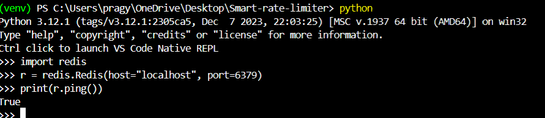
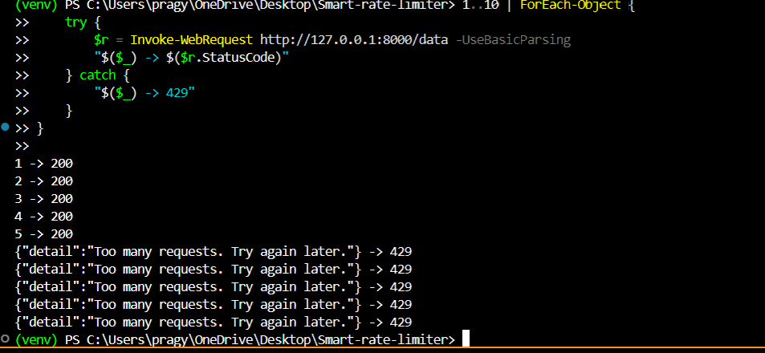
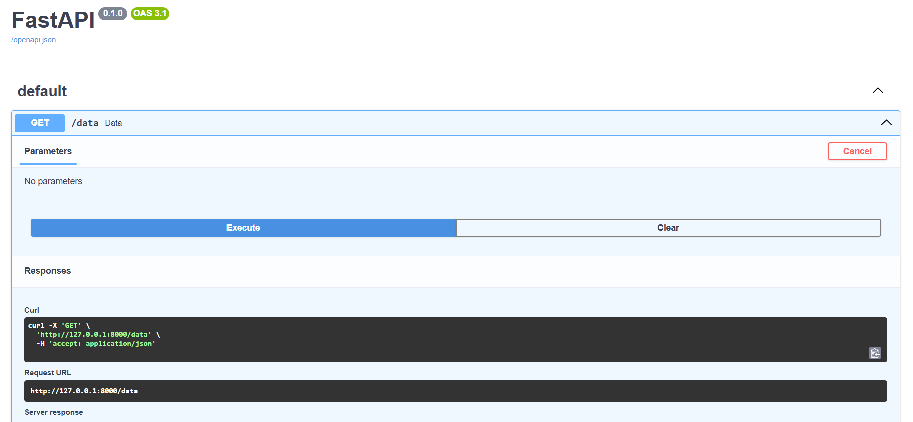
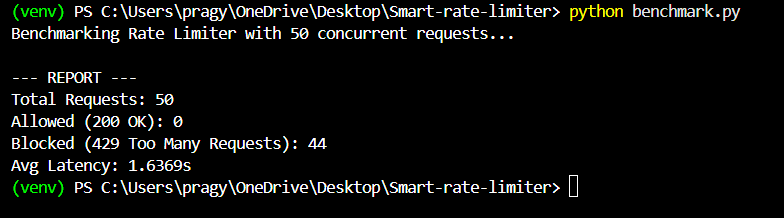

#  Smart Rate Limiter (FastAPI + Redis)

A production-style rate limiting system built with **FastAPI** and **Redis**, supporting:
- Per-IP request limits
- Fixed time window (1 minute)
- Atomic counting using Redis
- Adaptive limits based on system load (CPU)
- Concurrency-safe request handling

This project demonstrates how modern backend systems protect APIs from abuse using distributed rate limiting.

## Features

- FastAPI middleware-based rate limiting
- Redis-backed atomic counters (safe for concurrent users)
- Adaptive throttling based on system CPU usage
- Handles concurrent requests safely
- Benchmark script to simulate traffic
- Easy to extend for tiers (free/pro users)

##  Architecture

Client → FastAPI Middleware → Redis Counter → Allow / Block

- Each client IP gets a Redis key: `rate_limit:<ip>`
- Requests increment a counter atomically
- The counter expires every 60 seconds
- Requests beyond the limit receive HTTP 429

## Tech Stack

- Python 3.10+
- FastAPI
- Redis (Memurai on Windows)
- redis-py (async)
- psutil (for CPU monitoring)
- requests (for benchmarking)

##  Setup

1. Clone the repo

git clone https://github.com/<pragyaraw>/smart-rate-limiter.git
cd smart-rate-limiter

2. Create virtual environment

python -m venv venv
venv\Scripts\activate

3. Install dependencies

pip install -r requirements.txt

4. Start Redis
Make sure Redis (or Memurai) is running on:
localhost:6379

5. Run the server

uvicorn main:app --reload

## Screenshots

### Redis Connection (Memurai)

This screenshot verifies that the application is connected to Redis (Memurai on Windows) successfully.

### Rate Limiting in Action

After 5 requests per minute from the same client, further requests are blocked with HTTP 429.

### FastAPI Swagger UI

The API is automatically documented using Swagger UI.

### Benchmark / Load Test

This shows multiple concurrent requests being sent to the API to simulate load.

## Rate Limiting Logic

Implemented as FastAPI middleware:

Uses Redis INCR for atomic counting

Sets TTL of 60 seconds on first request

Blocks if request count exceeds limit

request_count = await r.incr(key)
if request_count == 1:
    await r.expire(key, 60)

if request_count > 5:
    return JSONResponse(status_code=429)

## Benchmarking
Run the benchmark to simulate 50 concurrent requests:

python benchmark.py

Sample output:

## Project Structure

smart-rate-limiter/
│
├── main.py          # FastAPI app & middleware
├── limiter.py       # In-memory fallback limiter
├── policies.py      # Adaptive throttling logic
├── benchmark.py     # Load testing script
├── requirements.txt
└── README.md

## Use Cases
API abuse prevention

DoS mitigation

SaaS plan enforcement

Fair usage control

🧑‍💻 Author
Built by Pragya Rawat as a backend systems and distributed systems project

📜 License
MIT License